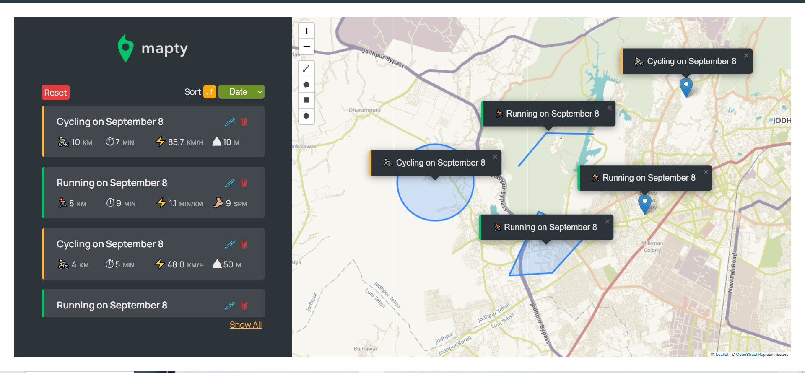

## 🗺️ Mapty Workout Tracker (try it live!)((https://yuvrajrawat14.github.io/PigGame/))

Welcome to Mapty, a browser-based application that allows you to log and visualize your running and cycling workouts on an interactive map. Built with pure JavaScript, it leverages your location to provide a seamless and personal workout tracking experience.

## 📸 Screenshots

Here's a quick look at the Mapty interface in action!

## 🎮 How to Use

1. **Allow Geolocation**: When the page loads, your browser will ask for permission to access your location. Click "Allow" to center the map on your current position.
2. **Log a Workout**: Click anywhere on the map to open the workout form on the left-hand sidebar.
3. **Enter Details**: Choose your workout type (Running or Cycling) and fill in the details like distance, duration, and cadence or elevation gain.
4. **Save Your Workout**: Click "OK" to save. Your workout will appear in the list and as a colored marker on the map.
5. **Interact with Workouts**: Click on any workout in the sidebar to pan the map to its location. You can also edit or delete workouts using the icons on each entry.

Can you take risks or play it safe? 🏆

## ✨ Features

- **Interactive Map**: Uses Leaflet.js to display a fully interactive map.
- **Geolocation**: Automatically detects your location to get you started right away.
- **Persistent Data**: All workout data is saved to your browser's localStorage, so your entries are saved between sessions.
- **Two Workout Types**: Log both Running 🏃‍♂️ and Cycling 🚴‍♀️ activities.
- **Workout Management**: Easily edit, delete, and sort your workouts.
- **Advanced Drawing**: Use the drawing tools to map your workout as a line, polygon, or circle instead of just a single point.
- **Object-Oriented Design**: Built with a clean, class-based architecture in JavaScript for better maintainability and scalability.

## 🛠️ Technologies Used

- **HTML5**: For the structure of the web page.
- **CSS3**: For custom styling and layout.
- **JavaScript (ES6+)**: Powers all the application logic, from handling user input to managing workout data.
- **Leaflet.js**: An open-source library for creating interactive maps.
- **Leaflet Draw**: A plugin for Leaflet that enables the drawing of shapes and lines.

## Flowchart

## Architecture

